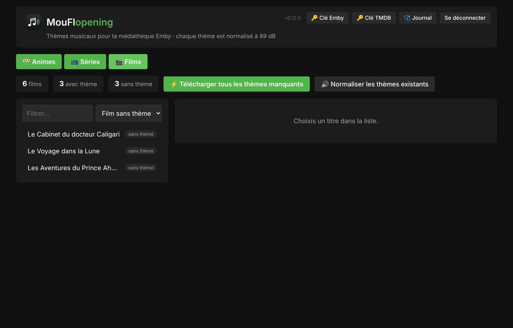
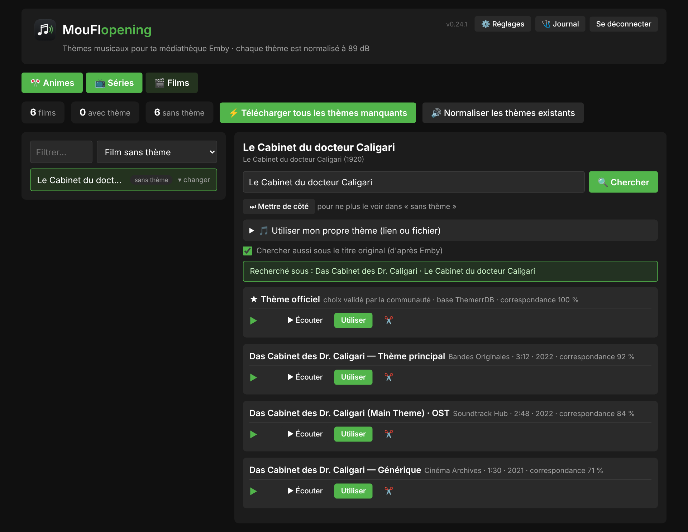
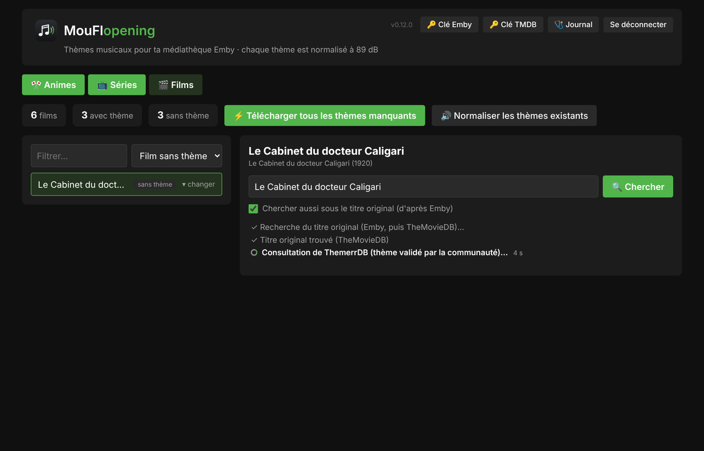
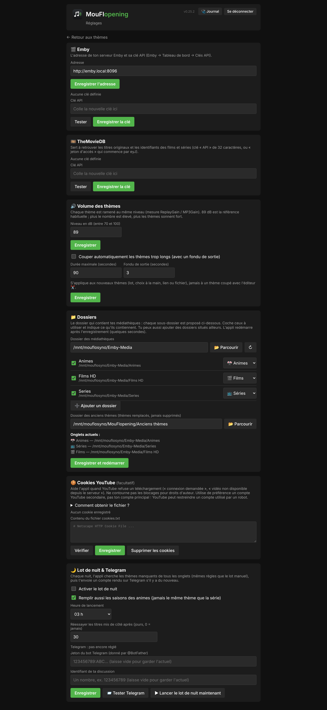
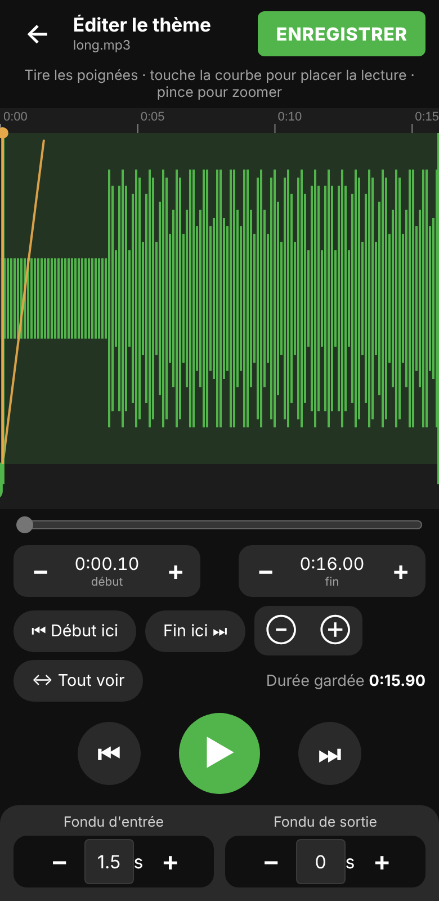
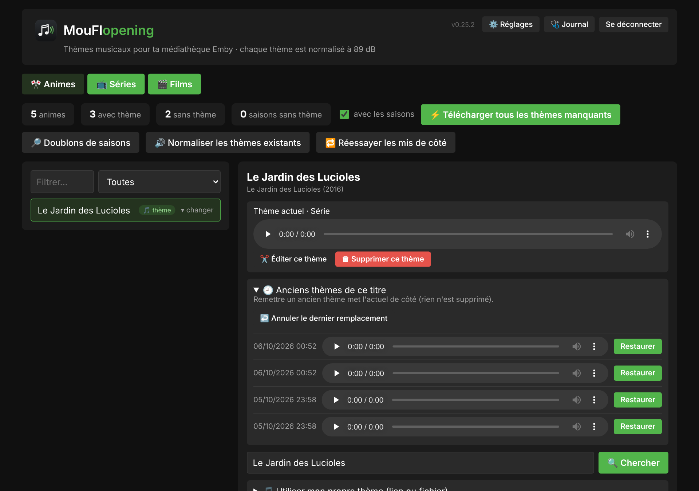
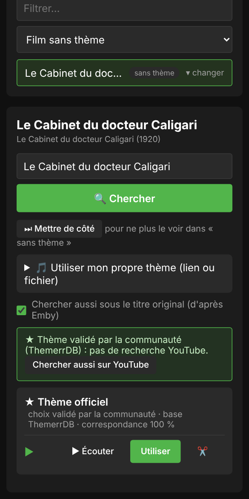

# MouFlopening 🎬🎵

[](LICENSE)
[](https://www.python.org/downloads/)

**Des thèmes musicaux pour ta médiathèque Emby** : une appli web qui trouve, télécharge et met en place le fichier `theme.mp3` de chaque film, série et anime, au bon niveau sonore.

## 📸 Aperçu

*Captures avec des données de démonstration.*

**La liste des films, séries et animes, avec ceux qui n'ont pas encore de thème**



**Les propositions pour un titre : la sélection ★ de la base ThemerrDB en tête, puis les résultats YouTube**



**La recherche annonce chaque étape en direct (titre original, ThemerrDB, YouTube…)**



**La page ⚙️ Réglages : Emby, TheMovieDB, volume, dossiers, cookies YouTube, lot de nuit et Telegram**



**L'éditeur audio (couper, zoomer, fondus), pensé pour le téléphone**



**Les anciens thèmes d'un titre : écouter, restaurer, annuler le dernier remplacement**



**Sur téléphone**



## ✨ Fonctionnalités

- 🎵 **Plusieurs sources** : AnimeThemes (génériques d'animes), ThemerrDB (thèmes validés par la communauté pour les films et séries) et YouTube
- 🎯 **Recherche soignée** : titre original d'après Emby et TheMovieDB, vérification des saisons d'animes, jamais le même thème pour une série et sa saison 1
- 📚 **Traitement par lots** : télécharge d'un coup tous les thèmes manquants, avec progression en direct et possibilité d'arrêter
- 🌙 **Lot de nuit** : l'appli cherche toute seule les thèmes manquants à l'heure choisie, puis envoie un compte rendu sur Telegram (thèmes ajoutés, et titres sans thème regroupés par raison)
- 🔊 **Volume homogène** : chaque thème est ramené au même niveau (89 dB par défaut, réglable)
- ✂️ **Éditeur audio** : coupe le début et la fin, zoom sur la courbe, fondus d'entrée et de sortie
- 🎶 **Ton propre thème** : colle un lien (YouTube ou autre) ou envoie un fichier audio
- 🔄 **Emby** : actualise seulement le titre concerné après chaque thème
- 🛟 **Rien n'est perdu** : l'ancien thème est mis de côté avant d'être remplacé, et on peut le réécouter et le **restaurer** d'un clic (« Annuler le dernier remplacement »)
- ✂️ **Coupe automatique** (option) : les thèmes trop longs sont coupés à la durée choisie, avec un fondu de sortie
- 🔁 **Titres mis de côté** : la raison et la date sont gardées, ils sont retentés automatiquement après N jours (réglable), ou tout de suite avec « Réessayer les mis de côté »
- 🛡️ **NAS vérifié avant chaque lot** : si le partage réseau n'est pas monté, rien n'est touché et Telegram prévient
- ⚙️ **Page Réglages** : adresse et clé d'Emby, clé TheMovieDB, volume, dossiers (avec explorateur), cookies YouTube, lot de nuit et Telegram, sans toucher à un fichier
- 🩺 **Journal et diagnostic** : un bouton pour copier l'état du serveur quand quelque chose ne va pas
- 📱 **Pensée pour le téléphone**, mises à jour automatiques de yt-dlp

## 🚀 Installation

Tout est expliqué dans [`INSTALL.md`](INSTALL.md) : installation sur un conteneur Proxmox/LXC, mises à jour automatiques depuis GitHub (cronjob chaque minute) et reconstruction complète après une panne.

En bref :

```bash
cd /opt
git clone https://github.com/mouflo/MouFlopening.git mouflopening
cd mouflopening
bash install.sh
```

Ouvre ensuite `http://<adresse-du-serveur>:8001`, puis la page **⚙️ Réglages** pour indiquer Emby, la clé TheMovieDB et tes dossiers. Les clés restent sur ton serveur (`data/secrets.env`), jamais sur GitHub.

## 📖 Utilisation

1. Choisis l'onglet **Animes**, **Séries** ou **Films** : l'appli montre ce qui n'a pas encore de thème.
2. Clique sur un titre : les propositions arrivent (la sélection ★ de la communauté en tête), avec un bouton pour les écouter.
3. **Utiliser** pose le thème dans le dossier du titre. Le bouton ✂️ ouvre l'éditeur pour couper ou ajouter des fondus avant.
4. Pour tout faire d'un coup : **Télécharger tous les thèmes manquants**, ou active le **lot de nuit** dans les Réglages.

## 🤝 Dans la même famille

[MouFlanimeXer](https://github.com/mouflo/MouFlanimeXer) (remux d'animes) · [MouFloster](https://github.com/mouflo/MouFloster) (posters) : même style et même page Réglages.

## 📝 Licence

Ce projet est sous licence MIT (voir le fichier `LICENSE`) : tu peux le réutiliser, le modifier et le partager librement.
